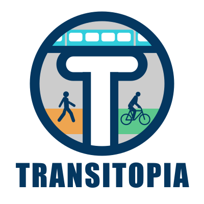
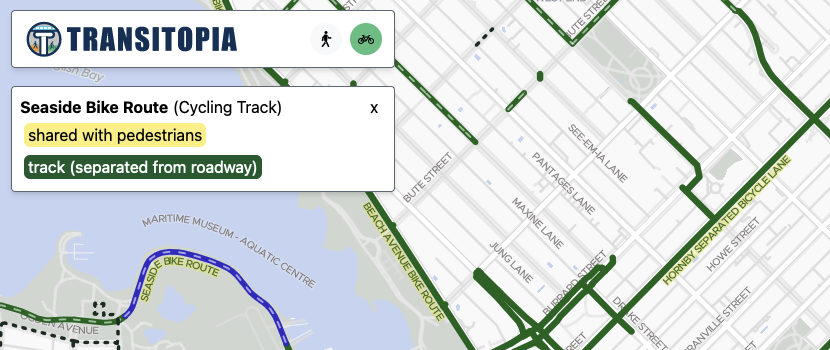

# Transitopia

Transitopia is a mapping project that aims to provide high-quality **public transit**, **cycling**, and **pedestrian** infrastructure maps. The goal is to promote best practices and celebrate high quality infrastructure, while calling attention to unsafe and low-quality infrastructure.

**Current status** (Jan 2024): We are working on **cycling** maps for the Metro Vancouver area, though the mapping process applies the same criteria throughout the province of BC, so the map will show cycling paths anywhere in the province of BC. **Transit** and **Pedestrian** maps will come in the future.

Online at: **[www.transitopia.org](https://www.transitopia.org/cycling)**.

## This repository

This Single Page Application implements a viewer for the Transitopia map.

It uses React + TypeScript + Vite + MapLibre GL.

## How to run Transitopia Locally

1. You need Node.js and Java 21+ on your system.
2. Clone this repo to your system.
3. Build the vector base map tiles file: The map data file is over 800 MiB so cannot be included in this git repository. Use the [Transitopia planetiler-openmaptiles](https://github.com/transitopia/planetiler-openmaptiles) repository to generate the `transitopia-base-bc.pmtiles` vector map data file using planetiler (see that repo's README). Copy the resulting map data file into this repo: `cp ../planetiler-openmaptiles/data/transitopia-base-bc.pmtiles public/transitopia-base-bc.pmtiles`.
4. Build the vector overlay tiles file: this contains the cycling paths, pedestrian paths, etc. and is specific to Transitopia. Use the [planetiler-transitopia](https://github.com/transitopia/planetiler-transitopia) repository to generate the `transitopia-cycling-bc.pmtiles` vector map data file using planetiler (see that repo's README). Copy the resulting map data file into this repo as `cp ../planetiler-transitopia/data/transitopia-cycling-british-columbia.pmtiles public/transitopia-cycling-bc.pmtiles`.
5. Install dependencies: `npm install`
6. Run the development server: `npm run dev`
7. Go to http://localhost:5173/ in your browser.

## Credits

Transitopia is a project by [Braden MacDonald](https://www.bradenmacdonald.com) ([@bradenmacdonald](https://github.com/bradenmacdonald) on GitHub).

All source code is open source and all data is open data, but the licenses vary.

The primary source of map data is [OpenStreetMap](https://www.openstreetmap.org/). Vector map tiles are generated using [planetiler](https://github.com/onthegomap/planetiler) - see the [planetiler-transitopia](https://github.com/transitopia/planetiler-transitopia) repository for all the details on how the map is generated.

The map is rendered using [MapLibre GL](https://maplibre.org/).

Map vector tile data is stored in the [PMTiles](https://github.com/protomaps/PMTiles) format.

The base map style is a customized version of [OpenMapTiles Positron](https://github.com/openmaptiles/positron-gl-style), and the base map is [a customized version of OpenMapTiles](https://github.com/transitopia/planetiler-openmaptiles).
